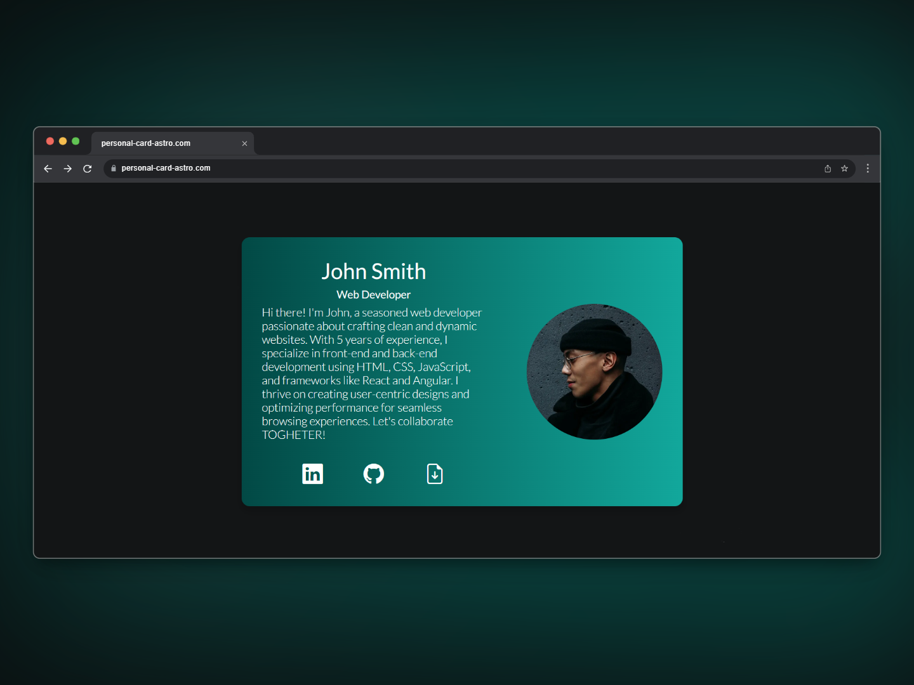
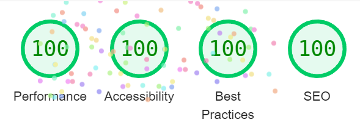
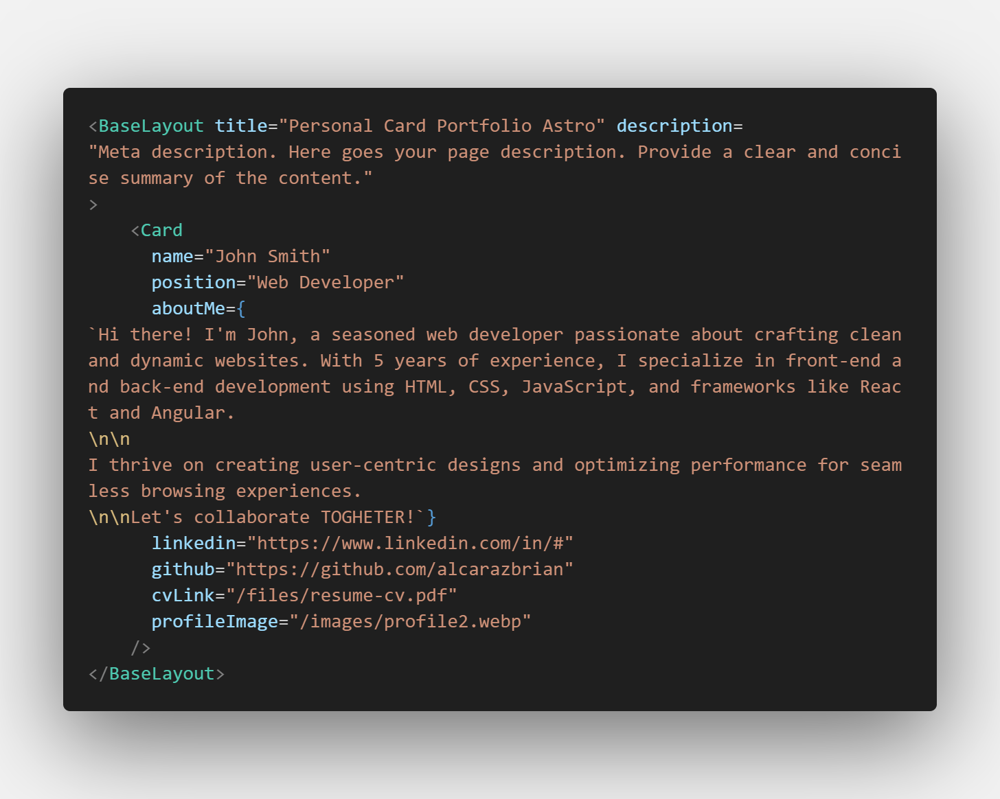

# Personal Professional Card Astro

"Hi there!, I'm Brian. I hope this small template helps you gain visibility while you build great projects. Thank you for using it. I wish you success in everything you set out to do; you will surely achieve great things.

You can help me by following me, giving a Star to the template, and sharing it so others can see and use it.

Have a great day!"






<hr/>

<h3 align="center">
 ⭐ Leave a star if you like this project! ⭐️
</h3>

## Deploy

[](https://personal-card-astro.netlify.app/)

## 🚀 Project Structure

Inside of your Astro project, you'll see the following folders and files:

```text
public/
  ├── files/
  |      └── resume-cv.pdf
  ├── images/
  |      └── profile2.webp
  ├── favicon.ico
src/
  ├── components/
  │     └── Card.astro
  ├── layouts/
  │     └── BaseLayout.astro
  ├── pages/
  │     └── index.astro
  ├── styles/
  │     ├── global.css
  │     └── card.css
```
# User Guide

This guide explains how to customize the template for your personal use. In the `src/pages/index.astro`



## External Card Customization

- **`title`**: This change will be reflected in the browser tab.
- **`description`**: This is a metadata tag used to provide a brief description of your page in search engines.

## Internal Card Customization

- **`name`**: Enter your name here.
- **`position`**: Enter your job position here.
- **`about me`**: Write a brief description of who you are and what you do. It's recommended to keep it under 540 characters.
- **`linkedin`** and **`github`**: Enter the URLs to your personal pages here.
- **`cvLink`**: Provide the URL to your resume in PDF format for download.
- **`profileImage`**: Upload your professional profile picture here.

## File Management

- **Resume**: Place your resume PDF file in the `public/files` folder.
- **Profile Image**: Place your profile image in the `public/images` folder. It's recommended to use the .webp format for better web performance.
- **Favicon**: Replace the `public/favicon.ico` file with your own, preferably keeping the same file name.

## Layout Customization

- In the `src/layouts` folder, you will find the `BaseLayout.astro` file. This file contains the complete HTML structure. Here, you will see references to the favicon, Google fonts, and Bootstrap icons.

## Style Customization

- In the `src/styles` folder, you will find the styles for the Card. You can make visual changes here, such as modifying colors, fonts, sizes, etc.


Easy, Right?


# Getting Started with Your Template

Follow these steps to initialize and deploy your template using Astro and Netlify.

## Prerequisites

Make sure you have the following installed on your machine:
- [Node.js](https://nodejs.org/) (version 14.x or higher)
- [npm](https://www.npmjs.com/) (comes with Node.js)
- [Astro](https://astro.build/) (installed globally)

## Installation

### Option 1: Clone the Template Repository

1. **Clone the Template Repository**

    ```bash
    https://github.com/alcarazbrian/professional-card-astro.git
    cd professional-card-astro
    ```

2. **Install Dependencies**

    ```bash
    npm install
    ```

### Option 2: Download the ZIP File

1. **Download the ZIP File**

    Download the template as a ZIP file from the repository's GitHub page.

2. **Extract the ZIP File**

    Extract the contents of the ZIP file to your desired location.

3. **Navigate to the Project Directory**

    Open your terminal and navigate to the extracted directory.

    ```bash
    cd path-to-extracted-directory
    ```

4. **Install Dependencies**

    ```bash
    npm install
    ```

## Running the Project Locally

To start the development server, run:

```bash
npm run dev
```
This command will start the Astro development server. You can view your site at http://localhost:4321. Any changes you make to the project files will be reflected in real time in your browser. To stop the development server, press Ctrl+C in the terminal.

## Building the Project

To build the project for production, run:

```bash
npm run build
```

## Deploying to Netlify

### Using Netlify Drop

1. **Build the Project**

   Ensure your project is built by running:

   ```bash
   npm run build
   ```

2. **Drag and Drop**

   Go to Netlify Drop. Drag and drop the `dist` folder from your project directory into the Netlify Drop area. This will upload and deploy your site.

   Your site should now be live on Netlify. You can view the live site URL in the output of the command or from your Netlify dashboard.


## Commands

All commands are run from the root of the project, from a terminal:

| Command                   | Action                                           |
| :------------------------ | :----------------------------------------------- |
| `npm install`             | Installs dependencies                            |
| `npm run dev`             | Starts local dev server at `localhost:4321`      |
| `npm run build`           | Build your production site to `./dist/`          |

## 👀 Want to learn more?

Feel free to check [Astro documentation](https://docs.astro.build) or jump into [Astro Discord server](https://astro.build/chat).

## Contact

[](https://www.linkedin.com/in/alcarazbrian)
